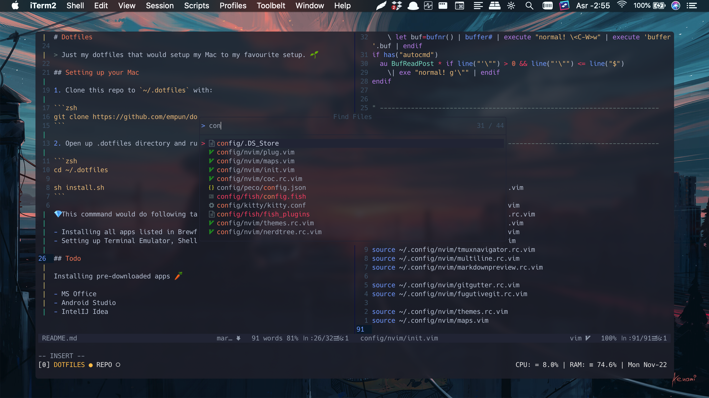
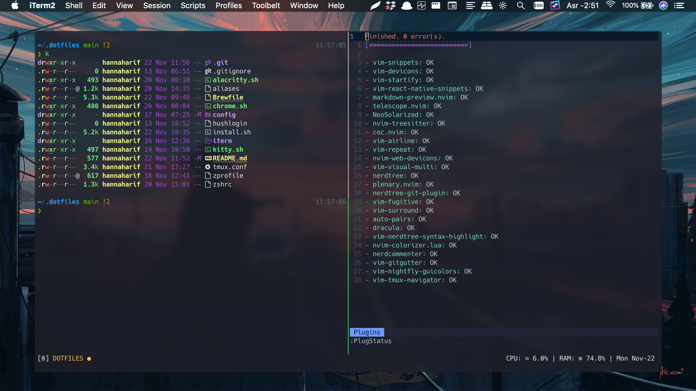

# Dotfiles

> Just my dotfiles that would setup my Mac to my favourite configs. 🌱

<p align="center"></p>
<p align="center"></p>

## Setting up your Mac

1. Clone this repo to `~/.dotfiles` with:

```zsh
git clone https://github.com/empun/dotfiles.git ~/.dotfiles
```

2. Run the installation script

```zsh
sh ~/.dotfiles/install.sh
```

💎 This command would do the following tasks :

- Installing all apps listed in Brewfile (see Brewfile)
- Setting up Terminal Emulator, Shell, Tmux and Neovim

3. Sync to Dropbox, then run the following

```zsh
# Symlink the Mackup config file to the home directory
ln -s $HOME/.dotfiles/.mackup.cfg $HOME/.mackup.cfg

# Restore all apps configuration
mackup restore
```

## Todo

Installing pre-downloaded apps 🥕

- MS Office
- Android Studio
- IntelIJ Idea
- Krita
- NTFS for Mac
